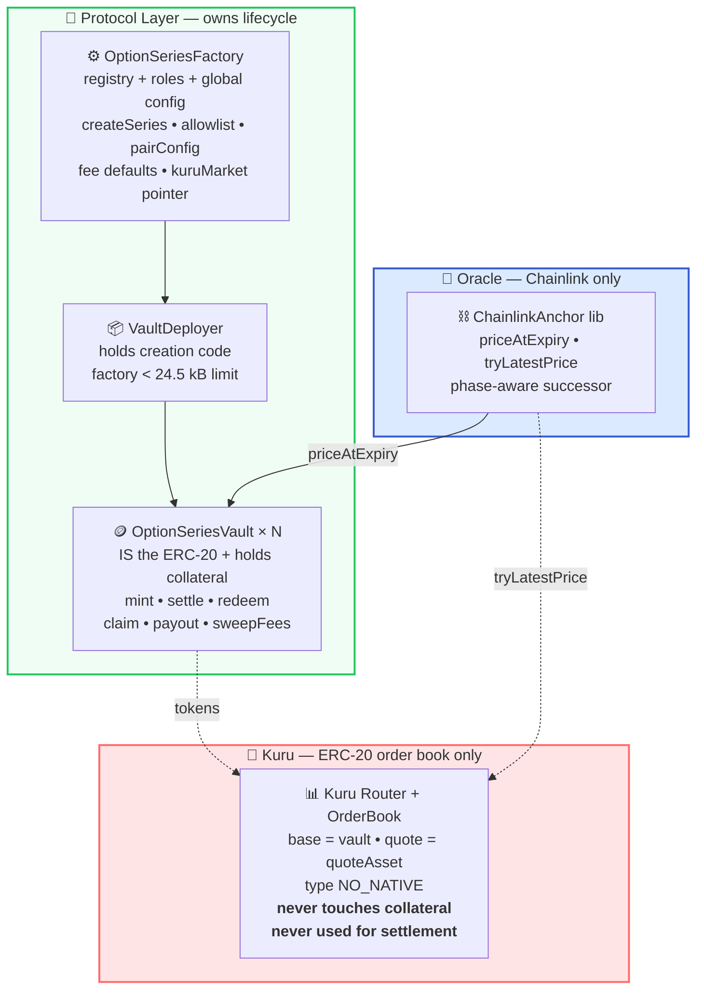

<div align="center">

# 🧑‍💻 Optara — Developer Guide

### *Technical reference for integrating, building, and auditing Optara V1*

   

**Not audited. Not deployed to mainnet.** 286 tests, fuzz + invariants, Slither-clean.

[🏗️ Architecture](#️-architecture) • [📦 Contracts](#-contracts) • [🧮 Math](#-math--exact-formulas) • [🔮 Oracle](#-oracle--settlement-proof) • [🚀 Deploy](#-deployment) • [🧪 Tests](#-tests)

</div>

---

<div style="background: linear-gradient(90deg, #ede9fe 0%, #eff6ff 100%); border: 2px solid #836EF9; border-radius: 12px; padding: 16px 20px;">

### 🎯 Design invariant

> **Trading changes `who owns` an option token. It never changes `how much the vault owes`.**
> Kuru = ownership. Chainlink = price at expiry. Vault = collateral + payout. No cross-contamination.

V1 is **fully collateralized European options, no leverage/margin/early-exercise**, one `ERC-20` per series, `Chainlink`-only settlement pinned to expiry.

</div>

---

## 🗺️ Spec map

| Spec | File | Role |
|:---|:---|:---|
| Lean V1 spec (start here) | [`simple-workflow/README.md`](./simple-workflow/README.md) | 6-file complete build spec — this folder alone is sufficient |
| Math + vectors + proofs | [`simple-workflow/math.md`](./simple-workflow/math.md) | Normative — 6 vectors must be reproduced bit-for-bit |
| Factory + Vault | [`simple-workflow/contracts.md`](./simple-workflow/contracts.md) | Storage, functions, roles, fees, errors — most detailed |
| Oracle (ChainlinkAnchor) | [`simple-workflow/oracle.md`](./simple-workflow/oracle.md) | `priceAtExpiry` proofs + phase-aware successor |
| Guard + frontend | [`simple-workflow/premium-guard.md`](./simple-workflow/premium-guard.md) | Advisory `PremiumExecutionGuard` + 7-step frontend checklist |
| Tests + invariants | [`simple-workflow/testing.md`](./simple-workflow/testing.md) | Vectors, unit, fuzz, invariant, reentrancy, anchoring |
| Security + D1-D12 | [`simple-workflow/security-and-launch.md`](./simple-workflow/security-and-launch.md) | Threats, founder decisions, runbook, checklist, keeper |
| Full 19-doc pack | [`workflow/README.md`](./workflow/README.md) | Reference — `simple-workflow/` wins on conflict |
| Contract README | [`contracts/README.md`](./contracts/README.md) | Layout, build, test matrix, sizes, mutation checks, status |

---

## 🏗️ Architecture



**Separation is the security model.** See `workflow/architectural.md:1` for trust boundaries, fee isolation, rounding discipline.

### Data model

**Immutable per series** (`SeriesConfig` at `simple-workflow/contracts.md:58`, stored as `immutable` in `contracts/src/OptionSeriesVault.sol:71`):

```
seriesId, optionType (CALL/PUT), underlying, quote, collateralAsset,
strikePrice (PRICE_SCALE), expiry, contractSize, optionDecimals,
minOptionAmount, maxTotalShortAmount, chainlinkFeed, feedDecimals,
maxChainlinkAgeAtExpiry, optionScale, uqScale, collateralPerOption,
mintFeeBps, exerciseFeeBps
```

**Mutable lifecycle state** (`OptionSeriesVault.sol:94`):

```
settled (bool), mintPaused (bool),
totalShortAmount, totalUnclaimedShortAmount,
collateralLocked, accruedFees,
totalBuyerPayoutClaimed, totalWriterResidualClaimed,
settlementPrice, buyerPayoutRate, writerResidualRate, settledAt,
writerShortBalance[address]
```

States are `ACTIVE` / `SETTLED` only — `expiry` is derived from `block.timestamp >= expiry`, pauses are separate flags. See `workflow/state-machine.md`.

---

## 📦 Contracts

<div align="center">

| Contract | File | Job | Runtime bytes |
|:---|:---|:---|---:|
| **OptionSeriesFactory** | `contracts/src/OptionSeriesFactory.sol:53` | Canonical registry (`vaultOf`/`seriesIdOf`), `AccessControl` (`ADMIN`/`PAUSER`), allowlist, `pairConfig`, caps, fee defaults, `kuruMarketOf` (write-once). `createSeries` is `nonReentrant`, permissionless, reverts on duplicate. Proxies via `VaultDeployer`. | `9,133` |
| **OptionSeriesVault** | `contracts/src/OptionSeriesVault.sol:59` | One per series — ERC-20 + collateral. `mint` `settle(proof)` `redeem` `claimWriterResidual` `payout(accounts)` `sweepFees` `setMintPaused`. All token moves `nonReentrant` + `SafeERC20`, CEI, `_burn` before transfer. | `12,268` |
| **VaultDeployer** | `contracts/src/VaultDeployer.sol` | Holds vault creation code (factory would be 25,039 bytes otherwise). `bind()` once, `deploy()` only by bound factory. Vault is constructed with **factory** address for roles/fees. | `17,670` |
| **PremiumExecutionGuard** | `contracts/src/PremiumExecutionGuard.sol:29` | Read-only advisory. `checkBuy`/`checkSell` return `CheckResult` (never revert) for UI. No funds, no trades. Totals in quote raw units. | `5,092` |
| **OptionMath** | `contracts/src/libraries/OptionMath.sol` | All payout math with explicit `mulDiv` rounding. | — |
| **ChainlinkAnchor** | `contracts/src/libraries/ChainlinkAnchor.sol` | `priceAtExpiry(feed, feedDecimals, expiry, maxAge, roundId, nextRoundId)` + `tryLatestPrice(feed, feedDecimals, maxAge)`. Phase-aware successor, `try/catch` on `getRoundData`, distinct errors. | — |

> Limit `24576` bytes (EIP-170). Sizes measured at `contracts/README.md:76`.

</div>

### Roles (only two) — `contracts/src/Types.sol:15`

| Role | ID | Who | Can | Cannot |
|:---|:---|:---|:---|:---|
| **ADMIN** | `DEFAULT_ADMIN_ROLE` `0x00` | Multisig/timelock | `setAllowedAsset`, `setPairConfig`, `setMaxShortAmount`, `setDefaultFeeConfig`, `setFeeRecipient`, `setKuruMarket` (write-once), `sweepFees` (via vault), guard params, grant/revoke, **freeze + unfreeze** (`setCreationPaused`/`setMintPaused`) | Move `collateralLocked`, change live series, change settlement, block `settle`/`redeem`/`claim`/`payout`/transfers |
| **PAUSER** | `keccak256("PAUSER_ROLE")` | Guardian | **Freeze only** (`true`) | Unfreeze, move funds, block payouts |

Vaults call `factory.hasRole(...)` — no vault-local roles.

### Series creation

**`CreateSeriesParams`** (`simple-workflow/contracts.md:41`) — the *only* user inputs:

```solidity
struct CreateSeriesParams {
    OptionType optionType;  // CALL or PUT
    address underlying;     // ERC-20
    address quote;          // ERC-20
    uint256 strikePrice;    // PRICE_SCALE (whole quote per whole underlying × 1e18)
    uint64 expiry;          // ≥ block.timestamp+1h, ≤ +30d,  expiry % 1 days == 8h
    address chainlinkFeed;  // must == pairConfig[pairKey(underlying,quote)].feed
}
```

**Validation in `OptionSeriesFactory.sol:113`:**

- `creationPaused` → `CreationPaused`
- zero/identical assets, not allowlisted → `ZeroAddress`/`AssetNotAllowed`
- `decimals() > 18` or unreadable → `InvalidDecimals`
- `pc.feed == 0 || p.chainlinkFeed != pc.feed` → `FeedNotApproved`
- `strikePrice == 0 || strikePrice % pc.strikeStep != 0` → `InvalidStrike`
- expiry window/slot → `InvalidExpiry`
- `seriesId` exists → `DuplicateSeries(seriesId)` — always reverts, no idempotent return

**`seriesId`** (`OptionSeriesFactory.sol:171`):

```solidity
keccak256(abi.encode(block.chainid, address(this), optionType, underlying, quote, strikePrice, expiry, chainlinkFeed))
```

**Factory-fixed** (snapshot/derive, never user-chosen):

| Field | Value |
|:---|:---|
| `contractSize` | `10 ** underlyingDecimals` (= 1 whole underlying) |
| `optionDecimals` | `OPTION_DECIMALS` = `18` |
| `minOptionAmount` | `MIN_OPTION_AMOUNT` = `0.01 × 1e18` |
| `maxTotalShortAmount` | `maxShortAmountOf[underlying]` snapshot, `0` = uncapped |
| `maxChainlinkAgeAtExpiry` | `pairConfig.maxChainlinkAgeAtExpiry` snapshot |
| fee rates | `defaultFeeConfig` snapshot (`mintFeeBps`/`exerciseFeeBps`, caps `100` bps each, `Types.sol:22`) |
| `name`/`symbol` | `Optara WMON/USDC Call #N` / `OPT-WMON-USDC-C-N` (`N = ++seriesCount`, pair from `symbol()` of allowlisted tokens, `?` if unreadable) |

**Admin setters:**

- `setAllowedAsset(asset, allowed)` — `ADMIN`, validates `decimals ≤ 18` if enabling
- `setPairConfig(underlying, quote, PairConfig)` — `ADMIN`, both allowlisted, `feed.code.length != 0`, `feed.decimals ≤ 18`, `latestRoundData` positive, `maxAge != 0`, `strikeStep != 0`; `feed=0` disables pair; affects only future series. Feed approval is **most security-critical** — two humans confirm direct feed for exactly that pair.
- `setMaxShortAmount` / `setDefaultFeeConfig` / `setFeeRecipient` / `setKuruMarket` — `ADMIN`, `setKuruMarket` write-once (`KuruMarketAlreadySet`), contracts never call Kuru.

### Vault lifecycle

| Function | When | Notes |
|:---|:---|:---|
| `mint(amount, receiver)` | `block.timestamp < expiry`, `!mintPaused`, `amount ≥ minOptionAmount`, `amount + totalShortAmount ≤ cap` | `collateralAmount = ceil(amount×cpo/OPTION_SCALE)`, `fee = ceil(collateral×mintFeeBps/BPS)`, `safeTransferFrom(collateral, amount+fee)`, CEI: balances → `collateralLocked`/`accruedFees` → `emit` → transfer → `_mint(receiver, amount)`. Short belongs to `msg.sender`. |
| `settle(proof)` | `block.timestamp ≥ expiry`, `!settled` | Not payable, no token calls. `price = ChainlinkAnchor.priceAtExpiry(...)` (`PRICE_SCALE`), `buyerRate` via call/put formula (floor), `writerRate = cpo - buyerRate` (subtraction only), write `settlementPrice`/`buyerPayoutRate`/`writerResidualRate`/`settledAt`/`settled=true`, `emit SeriesSettled`. |
| `redeem(amount, receiver)` | `settled`, `amount > 0` | Any nonzero — no min. `gross = floor(amount×buyerRate/SCALE)`, `fee = floor(gross×exerciseFeeBps/BPS)`, `net = gross-fee`, `_burn(msg.sender)`, `collateralLocked -= gross`, `accruedFees += fee`, `emit`, `safeTransfer(net)` if `>0` (skip on OTM to avoid zero-transfer revert). |
| `claimWriterResidual(short, receiver)` | `settled`, `short ≤ writerShortBalance[msg.sender]` | No fee. `amount = floor(short×writerRate/SCALE)`, decrement balances, `collateralLocked -= amount`, `emit`, transfer if `>0`. |
| `payout(accounts)` | `settled`, anyone | For each account: `gasleft < 250_000 → revert InsufficientGas` (loud failure, not silent skip), else `try this.payAccount(account) catch {}`. `payAccount` (`nonReentrant`, only `address(this)`) skips `0`/`code.length>0`, redeems **entire** `balanceOf(account)` to `account` and claims **entire** `writerShortBalance` to `account` (full-balance only, no chunked rounding burn). Each account in isolated self-call so one failing transfer (e.g., blacklisted USDC) doesn’t block others. |
| `sweepFees()` | `ADMIN` only, anytime even when paused/before settlement | No receiver arg — always `factory.feeRecipient()` live. `amount = accruedFees`, `accruedFees=0`, `emit`, `safeTransfer`. Never reads/reduces `collateralLocked`. Reverts `NoFeesAccrued` if `0`. |
| `setMintPaused(paused)` | freeze: `PAUSER‖ADMIN`, unfreeze: `ADMIN` only | Only blocks `mint`. Never blocks `settle`/`redeem`/`claim`/`payout`/`sweepFees`/transfers. |

**Invariants (always):**

```
totalSupply == totalShortAmount                          (before settlement)
sum(writerShortBalance) == totalUnclaimedShortAmount
collateralLocked ≥ requiredCollateral(totalShortAmount)   (sum ceil ≥ ceil sum, with slack)
vault.balance ≥ collateralLocked + accruedFees
buyerPayoutRate + writerResidualRate == collateralPerOption   (exact, every price)
totalBuyerPayoutClaimed + totalWriterResidualClaimed + collateralLocked == totalCollateralEverLocked
```

---

## 🧮 Math — exact formulas

> Normative at `simple-workflow/math.md:30` and `contracts/src/libraries/OptionMath.sol`. Use `Math.mulDiv` with explicit rounding; never a second formula. Scales computed once as `immutable`.

**Constants & scales:**

```
PRICE_SCALE  = 1e18
BPS_SCALE    = 10_000
OPTION_SCALE = 10 ** optionDecimals   (= 1e18, V1)
UQ_SCALE     = PRICE_SCALE * 10**underlyingDecimals / 10**quoteDecimals   (≥1, exact)
contractSize C = 10 ** underlyingDecimals   (= 1 whole underlying, V1)
```

**The one conversion:**

```
quoteRaw(underlyingRaw, price) = underlyingRaw * price / UQ_SCALE
```

**Collateral:**

```
CALL: cpo = C
PUT:  cpo = ceilDiv(C * K, UQ_SCALE)
requiredCollateral(a) = ceilDiv(a * cpo, OPTION_SCALE)
```

**Settlement rates** (collateral raw per whole option, rounded down, `writerRate` by subtraction only):

```
CALL: if S ≤ K → buyerRate = 0
      else      buyerRate = floor(C * (S - K) / S)

PUT:  if S ≥ K → buyerRate = 0
      else      buyerRate = floor(C * (K - S) / UQ_SCALE)

writerRate = cpo - buyerRate
// proof that writerRate ≥ 0: (S-K)/S < 1 for calls; C*(K-S) < C*K for puts
```

**Claims (floor):**

```
grossBuyer(a)    = floor(a * buyerRate  / OPTION_SCALE)
grossWriter(a)   = floor(a * writerRate / OPTION_SCALE)
exerciseFee      = floor(grossBuyer * exerciseFeeBps / BPS_SCALE)
```

**Rounding (immutable):**

| Value | Dir | | Value | Dir |
|:---|:---:|---|:---|:---:|
| `cpo` (put) | ⬆️ | | `gross claims` | ⬇️ |
| `requiredCollateral` | ⬆️ | | `mintFee` | ⬆️ (on top) |
| `buyerRate` | ⬇️ | | `exerciseFee` | ⬇️ (from gross) |
| `writerRate` | ➖ sub | | | |

**Solvency proof** (`math.md:128`):

```
floor(a*rb/OS)+floor(a*rw/OS) ≤ a*(rb+rw)/OS = a*cpo/OS ≤ ceil(a*cpo/OS) = requiredCollateral
```

Many writers/holders: `sum ceil(a_i*cpo/OS) ≥ ceil(sum a_i * cpo/OS) ≥ sum floor(b_j*rb/OS) + sum floor(w_k*rw/OS)`.

**Vectors (normative, bit-for-bit):**

| # | Type | Key |
|:---:|---|:---|
| 1 | Call 18/6, exact division | `C=1e18 K=10e18 S=12.5e18` → `cpo=1e18` `buyer=2e17` `writer=8e17` |
| 2 | Put 8/6 | `C=1e6 K=60000e18 S=55000e18` → `cpo=6e8` |
| 3 | Call, dust `1 wei` | `K=3e18 S=7e18` → non-terminating `4/7` → dust `1` |
| 4 | OTM both | `buyer=0 writer=cpo`, redeem burns pays `0` skips transfer |
| 5 | Fees on Vector 1 | `mintFee=ceil(5e18*10/1e4)=5e15` `exerciseFee=floor(1e18*25/1e4)=2.5e15` |
| 6 | Put factory-fixed `C=1e8` | `C=1e8` (1 whole BTC) `K=60000e18` → `cpo=6e10` |

See full integers at `simple-workflow/math.md:188`.

---

## 🔮 Oracle — settlement proof

> `simple-workflow/oracle.md:1` — V1 is Chainlink-only. No second oracle, no quorum.

**Price format:** `normalizedPrice = answer * 10^(18 - feedDecimals)`, `feedDecimals ≤ 18` stored as `immutable` from `feed.decimals()` at vault construction.

**Only direct feeds.** Composed prices (e.g., `MON/USD ÷ USDC/USD`) are unsupported in V1 — would need two proven rounds.

**The pinned price:**

```
settlementPrice = answer of round IN FORCE at expiry
                = last round with updatedAt ≤ expiry
                  proven by immediate successor with updatedAt > expiry
```

**`SettlementProof`** (`Types.sol:97`):

```solidity
struct SettlementProof { uint80 chainlinkRoundId; uint80 chainlinkNextRoundId; }
```

Successor’s answer is never used — only to prove nothing newer existed at/before expiry.

**`ChainlinkAnchor.priceAtExpiry` checks** (`oracle.md:82`):

```
require(roundId != 0)                          else SettlementAnchorZeroRoundId
require(nextRoundId != roundId)                else SettlementAnchorRoundsNotDistinct
(accept, updatedAtRound) = try getRoundData(roundId)      else SettlementAnchorRoundUnavailable
(accept, updatedAtNext)  = try getRoundData(nextRoundId)  else SettlementAnchorSuccessorUnavailable
require(isImmediateSuccessor(feed, roundId, nextRoundId))  else SettlementAnchorNotImmediateSuccessor
require(updatedAtRound ≤ expiry)                           else SettlementAnchorRoundAfterExpiry
require(updatedAtNext  > expiry)                           else SettlementAnchorSuccessorNotAfterExpiry
require(expiry - updatedAtRound ≤ maxChainlinkAgeAtExpiry) else SettlementAnchorTooStale
require(answer > 0)                                        else OracleInvalid
price = answer * 10^(18 - feedDecimals)
```

Wrap both `getRoundData` in `try/catch`; each failure has a distinct error. `_tryRound` also asserts returned `roundId == requested` and `answeredInRound ≥ roundId`.

**`isImmediateSuccessor`** (`oracle.md:112`):

```
proxyRoundId = (phaseId << 64) | aggregatorRoundId
phase(id) = id >> 64   agg(id) = id & ((1<<64)-1)

if phase(next) == phase(round):  return agg(next) == agg(round)+1
if phase(next) == phase(round)+1:
    if agg(next) != 1: return false
    return try getRoundData(round+1) is missing (updatedAt==0 or revert)
else: return false
```

Never derive successor as `roundId+1`; caller supplies, library verifies. Tested exhaustively at `contracts/test/ChainlinkAnchorSuccessor.t.sol` (attack shapes, `type(uint80).max` overflow, 3 fuzzes vs. reference impl).

**`tryLatestPrice`** (guard reference, never settlement):

```
(, answer,, updatedAt,) = feed.latestRoundData() in try/catch
ok = answer>0 && updatedAt>0 && updatedAt ≤ block.timestamp && block.timestamp-updatedAt ≤ maxAge
```

**`maxChainlinkAgeAtExpiry`:** per-pair, `ADMIN` sets via `setPairConfig`, copied into series, measures against `expiry` (not `block.timestamp`) → result independent of when `settle()` is called. Set to heartbeat + buffer; too small → healthy quiet feed before expiry becomes unsettleable.

**Building the proof (keeper/frontend):**

1. Poll feed; if `latest.updatedAt ≤ expiry` → successor doesn’t exist → wait.
2. Binary search within phase for last `updatedAt ≤ expiry` via `getRoundData`.
3. If search hits start of phase (first round already `> expiry`), round-in-force is last round of previous phase (use `phaseAggregators` on proxy).
4. Successor = immediate successor per phase rule.
5. `settle({proof})` — wrong proof simply reverts.

**Timing & failure:**

- Can’t succeed until first round after expiry exists (≤ one heartbeat). Not a lock; keeper polls.
- Permanent lock if: never publishes after expiry, or round-in-force older than `maxAge`. No fallback; no V1 recovery — decision **D9** (`security-and-launch.md:92`), must be disclosed or add timelocked recovery before mainnet.

---

## 🛒 Premium & Guard

> `simple-workflow/premium-guard.md:1` — premium is Kuru trade input, never vault input.

**Realized premium:** `totalPremiumPaid = Σ(fillAmount_i × fillPrice_i)`, `realizedPerOption = totalPremiumPaid / totalAmountReceived` (weighted average over fills).

**Two layers:**

- **Layer 1 — hard (Kuru):** limit price + min output on the order. Frontend must derive both from buyer’s **all-in** cost (`premium + takerFee`).
- **Layer 2 — advisory (`PremiumExecutionGuard`):** `factory.vaultOf(seriesId) != 0`, not expired, `market == factory.kuruMarketOf(seriesId)`, `block.timestamp ≤ deadline`, `venueFee ≤ maxVenueFeeBps`, `tryLatestPrice` ok, then oracle-based bounds. In V1 nothing forces a trade through the guard — future router must call and revert on `valid==false`.

**Bounds** (`premium-guard.md:132`, totals in quote raw, every step `mulDiv` with explicit rounding toward rejection):

```
E_up   = ceil(a * C / OPTION_SCALE)     E_down = floor(a * C / OPTION_SCALE)
callIntrinsic = ceil(E_up * max(R-K,0) / UQ_SCALE)
putIntrinsic  = ceil(E_up * max(K-R,0) / UQ_SCALE)
callHardGross = floor(E_down * R / UQ_SCALE)    putHardGross = floor(E_down * K / UQ_SCALE)
hardMax       = floor(hardGross * (BPS-exerciseFeeBps) / BPS)   // net of exercise fee
acceptableMin = ceil(intrinsic * (BPS-sellerDiscountToleranceBps) / BPS)
```

Minimums ceil, maximums floor; `E_up`/`E_down` not shared. Empty range (`acceptableMin > hardMax`, deep ITM when `sellerTol < exerciseFee`) → `EMPTY_RANGE`. Guard params: `sellerDiscountToleranceBps ≤ 10_000`, `maxReferenceAge`, `maxVenueFeeBps ≤ 10_000` (`ADMIN` only).

**`checkBuy`:** `takerFee = ceil(gross×takerFeeBps/BPS)`, `allInCost = gross+takerFee`, `allInCost > buyerMaxTotalPremium → ABOVE_BUYER_LIMIT`, `allInCost > hardMax → ABOVE_HARD_MAX`.

**`checkSell`:** `netProceeds = gross + floor(gross×makerFeeBps/BPS)` if rebate else `gross - ceil(gross×makerFeeBps/BPS)`, `netProceeds < acceptableMin → BELOW_ACCEPTABLE_MIN` (rounds toward lower `netProceeds`).

Frontend rules (`premium-guard.md:184`): verify `isOptionToken` + `kuruMarketOf`, walk depth for size (no extrapolation), refuse on spread/impact/quote-age, call `checkBuy`, require buyer `maxTotalCost` + `minAmountOut` + `deadline`, build Kuru order so Kuru enforces limit, show protocol vs venue fees separately, warnings for thin liquidity / market price ≠ settlement / deadline is frontend-only / tokens in Kuru orders not auto-paid.

**Kuru market creation:** anyone via `Router.deployProxy` (`NO_NATIVE` for two ERC-20s), base=vault quote=quoteAsset; calibrate `sizePrecision`/`pricePrecision`/`tickSize`/`minSize` so normal orders don’t round to zero; then `ADMIN setKuruMarket` after confirming base/quote.

Until verified on deployed market, frontend assumes taker fee **added to quote spent** and maker-side is a **fee not rebate**, plus AMM spread as extra cost.

---

## 💰 Fees — protocol isolation

| Fee | When | Who | Rounding | Invariant |
|:---|:---|:---|:---:|---|
| Mint `mintFeeBps` | `mint` | writer | ⬆️ `ceil(collateral×bps/BPS)` | added on top, `collateralLocked += collateral` |
| Exercise `exerciseFeeBps` | `redeem` ITM | holder | ⬇️ `floor(gross×bps/BPS)` | `collateralLocked -= gross`, `accruedFees += fee`, only `net=gross-fee` leaves |

Caps `MAX_MINT_FEE_BPS = MAX_EXERCISE_FEE_BPS = 100` (`Types.sol:22`), compile-time. Rates snapshot at creation, immutable; `setDefaultFeeConfig` affects only future series. Writer residual has no fee. `sweepFees` accrue-and-pull (no recipient transfer inside `mint`/`redeem`/`claim`). With both rates `0`, bit-identical to no-fee path (fuzz target).

---

## 🚨 Error & Event catalog — reference

> All `CustomError`s are at `contracts/src/Errors.sol` and `simple-workflow/contracts.md:538`. All events at `simple-workflow/contracts.md:487`.

<div align="center">

| Error | When it reverts | Where |
|:---|:---|:---|
| `ZeroAddress()` | `factory/vault/feeRecipient/receiver == 0`, or `receiver == vault` | Factory + Vault |
| `AssetNotAllowed()` | asset not allowlisted or `underlying == quote` | `createSeries`, `setPairConfig` |
| `InvalidDecimals()` | token has no code, `decimals()` reverts or `>18` | Factory |
| `InvalidStrike()` | `K==0` or `K % strikeStep !=0` | Factory + Vault ctor |
| `InvalidExpiry()` | `< now+1h` or `> now+30d` or `expiry % 1 days != 8h` | Factory + Vault ctor |
| `InvalidContractSize()` | `C==0` | Vault ctor |
| `InvalidMinOptionAmount()` | `minAmount==0` or `cpo==0` or `requiredCollateral(min)==0` | Vault ctor |
| `InvalidOracleConfig()` | feed no code, `decimals>18`, `latest answer<=0 / updatedAt==0`, `maxAge==0` or `strikeStep==0` | Factory + Vault |
| `DuplicateSeries(seriesId)` | `vaultOf[seriesId] != 0` — always reverts, no idempotent return | `createSeries` |
| `CreationPaused()` | `creationPaused == true` | `createSeries` |
| `FeedNotApproved()` | `pc.feed==0` or `p.feed != pc.feed` | `createSeries` |
| `FeeExceedsCap()` | `mintFeeBps>100` or `exerciseFeeBps>100` | Factory + Vault |
| `KuruMarketAlreadySet()` | `kuruMarketOf[seriesId] !=0` — write-once | `setKuruMarket` |
| `SeriesNotFound()` | `vaultOf[seriesId]==0` | `setKuruMarket` |
| `Unauthorized()` | `msg.sender` lacks role or `payAccount` not called by vault | Vault + Guard |
| `AccessControlUnauthorizedAccount` | OZ `AccessControl` — `hasRole` fails | Factory |
| `MintPaused()` | `mintPaused == true` | `mint` |
| `Expired()` | `block.timestamp >= expiry` | `mint` |
| `NotExpired()` | `block.timestamp < expiry` | `settle` |
| `AlreadySettled()` | `settled == true` | `settle` |
| `NotSettled()` | `settled == false` | `redeem`/`claim`/`payout` |
| `AmountTooSmall()` | `amount==0` or `< minOptionAmount` (mint) or `requiredCollateral==0` | `mint`/`redeem`/`claim` |
| `OpenInterestCapExceeded()` | `totalShort+amount > maxTotalShortAmount` | `mint` |
| `NoFeesAccrued()` | `accruedFees==0` | `sweepFees` |
| `InsufficientGas()` | `gasleft < 250_000` at start of an account in `payout` | `payout` |
| `InsufficientShortBalance()` | `shortAmount > writerShortBalance[msg.sender]` | `claim` |
| `InvalidGuardParam()` | `bps > 10_000` | `PremiumExecutionGuard` |
| `AlreadyBound()` | `deployer.factory != 0` already set | `VaultDeployer.bind` |
| `OracleInvalid()` | `answer <=0` at settlement | `ChainlinkAnchor` |
| `SettlementAnchorZeroRoundId()` | `roundId==0` | `priceAtExpiry` |
| `SettlementAnchorRoundsNotDistinct()` | `roundId==nextRoundId` | `priceAtExpiry` |
| `SettlementAnchorRoundUnavailable()` | `getRoundData(roundId)` reverts or `updatedAt==0` or id mismatch | `priceAtExpiry` |
| `SettlementAnchorSuccessorUnavailable()` | same for `nextRoundId` | `priceAtExpiry` |
| `SettlementAnchorNotImmediateSuccessor()` | phase check fails (skip, wrong `agg==1`, probe) | `priceAtExpiry` |
| `SettlementAnchorRoundAfterExpiry()` | `updatedAtRound > expiry` | `priceAtExpiry` |
| `SettlementAnchorSuccessorNotAfterExpiry()` | `updatedAtNext <= expiry` | `priceAtExpiry` |
| `SettlementAnchorTooStale()` | `expiry - updatedAtRound > maxAge` | `priceAtExpiry` |

</div>

<br>

<div align="center">

| Event | Signature | Indexed | Emitted by | When |
|:---|:---|:---|:---|:---|
| `SeriesCreated` | `SeriesCreated(seriesId, vault, creator, optionType, underlying, quote, strikePrice, expiry, feed)` | `seriesId, vault, creator` | Factory | `createSeries` |
| `PairConfigSet` | `PairConfigSet(pairKey, feed, maxAge, strikeStep)` | `pairKey` | Factory | `setPairConfig` (including `feed=0` disable) |
| `AssetAllowed` | `AssetAllowed(asset, allowed)` | `asset` | Factory | `setAllowedAsset` |
| `MaxShortAmountSet` | `MaxShortAmountSet(underlying, amount)` | `underlying` | Factory | `setMaxShortAmount` |
| `DefaultFeeConfigSet` | `DefaultFeeConfigSet(mintFeeBps, exerciseFeeBps)` | — | Factory | `setDefaultFeeConfig` |
| `FeeRecipientSet` | `FeeRecipientSet(recipient)` | `recipient` | Factory | `setFeeRecipient` |
| `CreationPauseSet` | `CreationPauseSet(paused)` | — | Factory | `setCreationPaused` |
| `KuruMarketSet` | `KuruMarketSet(seriesId, market)` | `seriesId, market` | Factory | `setKuruMarket` |
| `OptionsMinted` | `OptionsMinted(writer, receiver, optionAmount, collateralAmount, feeAmount)` | `writer, receiver` | Vault | `mint` |
| `SeriesSettled` | `SeriesSettled(settlementPrice, buyerPayoutRate, writerResidualRate)` | — | Vault | `settle` |
| `OptionsRedeemed` | `OptionsRedeemed(holder, receiver, optionAmount, grossPayout, feeAmount)` | `holder, receiver` | Vault | `redeem` / `payout→payAccount` |
| `WriterResidualClaimed` | `WriterResidualClaimed(writer, receiver, shortAmount, residualAmount)` | `writer, receiver` | Vault | `claim` / `payout→payAccount` |
| `FeesSwept` | `FeesSwept(receiver, amount)` | `receiver` | Vault | `sweepFees` |
| `MintPauseSet` | `MintPauseSet(paused)` | — | Vault | `setMintPaused` |
| `SellerDiscountToleranceSet` | `SellerDiscountToleranceSet(bps)` | — | Guard | `setSellerDiscountToleranceBps` |
| `MaxReferenceAgeSet` | `MaxReferenceAgeSet(seconds)` | — | Guard | `setMaxReferenceAge` |
| `MaxVenueFeeSet` | `MaxVenueFeeSet(bps)` | — | Guard | `setMaxVenueFeeBps` |

> `Transfer` / `Approval` from `ERC20` are also emitted. Fees are always a separate field — never folded into net.

</div>

---

## 🔐 Security & invariants

**Threats → mitigations** (full matrix `simple-workflow/security-and-launch.md:23`):

| Threat | Mitigation |
|:---|:---|
| Undercollateralized mint, double redeem, early exercise | `ceil` collateral, burn-before-transfer, `nonReentrant`+CEI, `block.timestamp≥expiry` gate, `!settled` gates |
| Caller-chosen settlement price | pinned to expiry, same price minutes vs months later |
| Forged anchor (earlier/later round, skipped successor, phase jump) | `updatedAtRound≤expiry<updatedAtNext`, phase-aware `isImmediateSuccessor`, `maxAge` check |
| Wrong feed | one feed per pair, `FeedNotApproved` if `p.chainlinkFeed != pc.feed`, `feed=0` disables pair |
| Bad series | `ADMIN`/`PAUSER` freeze `mint` only, `ADMIN` disables pair; existing positions can’t be rescued, only stopped from growing |
| Series spam / front-run | deployment cost, expiry slot + 30-day + `strikeStep` bounds count, frontend lists only with OI/market; duplicate reverts, attacker just creates what second caller wanted |
| Compromised `PAUSER`/`ADMIN` | `PAUSER` can’t unfreeze/move funds; `ADMIN` needs multisig+timelock, can’t move `collateralLocked`/block payouts |
| Kuru manipulation / bad premium | never vault input; limit+minOutput + advisory guard + fail-closed on thin/stale/wide |
| Fake token | `isOptionToken` is source of truth |
| Reentrancy / fee-on-transfer / rebasing | `nonReentrant`+CEI+`SafeERC20`+allowlist (no balance-delta) |
| Rounding extraction / decimal mismatch | `ceil` collateral/`floor` claims/`sub` residual, `minOptionAmount` mint-only, one `UQ_SCALE` formula, vectors per decimal pair |
| Dust / redemption lockout / fee drain | dust kept, `minAmount` mint-only so sub-min can exit, `accruedFees` segregated |
| Keeper tricks (chunked burn, contract holdings, one failure blocks all) | `payout` full-balance only, skips `code.length>0`, `try/catch` per account |

**See** `workflow/security-threat-model.md` for extended vectors and `simple-workflow/security-and-launch.md:59` “Do Not” list.

---

## 📍 Deployments — addresses & ABIs

> **Status: Not deployed to mainnet yet.** Tables below are placeholders — fill after `Deploy.s.sol` + `ConfigurePair.s.sol`. Keep this file as source of truth and mirror to `deployments/*.json`.

<div align="center">

| Network | Chain ID | RPC (example) | Explorer |
|:---|---:|---|:---|
| **Monad Testnet** | `*TBD*` | `https://testnet-rpc.monad.xyz` | `https://testnet-explorer.monad.xyz` |
| **Monad Mainnet** | `*TBD*` | `https://rpc.monad.xyz` | `https://explorer.monad.xyz` |

</div>

<br>

<div style="background: #fef3c7; border: 1px solid #fde68a; border-radius: 8px; padding: 12px 16px;">

⚠️ **Before mainnet:** verify `WMON` address, confirm direct Chainlink feeds (feed → pair), and record `heartbeat`/`maxChainlinkAgeAtExpiry` in `deployments/oracle-feeds.md`. See `simple-workflow/security-and-launch.md:92` (D4/D9).

</div>

<br>

<div align="center">

| Contract | Testnet | Mainnet | ABI |
|:---|:---|:---|:---|
| **OptionSeriesFactory** | `0x...TBD` | `0x...TBD` | `contracts/out/OptionSeriesFactory.sol/OptionSeriesFactory.json` |
| **VaultDeployer** | `0x...TBD` | `0x...TBD` | `contracts/out/VaultDeployer.sol/VaultDeployer.json` |
| **PremiumExecutionGuard** | `0x...TBD` | `0x...TBD` | `contracts/out/PremiumExecutionGuard.sol/PremiumExecutionGuard.json` |
| **OptionSeriesVault** *(per series)* | `factory.vaultOf(seriesId)` | `factory.vaultOf(seriesId)` | `contracts/out/OptionSeriesVault.sol/OptionSeriesVault.json` |
| **WMON** | `0x...TBD` | `0x...TBD` | `WETH9` |
| **USDC** (quote) | `0x...TBD` | `0x...TBD` | ERC-20 6 decimals |

| Pair | Chainlink feed | `feedDecimals` | Heartbeat | `maxAgeAtExpiry` | `strikeStep` | `maxShortAmount` |
|:---|:---|---:|---|---|---:|---:|
| `WMON/USDC` | `0x...TBD` | `8` | `*TBD* (e.g., 3600s)` | `heartbeat + buffer (e.g., 4500s)` | `*TBD* e.g., 0.5e18` | `*TBD*` |
| `WBTC/USDC` | `*TBD — only if direct feed exists*` | — | — | — | — | — |

> Kuru `Router` on Monad: testnet `0x7EFbE105Ca7415dE98F96622173458ac1c054630`, mainnet `0xd651346d7c789536ebf06dc72aE3C8502cd695CC` (re-verify before use at `simple-workflow/premium-guard.md:238`). Vaults **never** call Kuru — market at `factory.kuruMarketOf(seriesId)` is write-once.

</div>

<br>

**Artifacts to commit after each deploy** (`simple-workflow/security-and-launch.md:124`):

```
deployments/monad-testnet.json      # chainId, factory, deployer, guard, feeRecipient, roles
deployments/monad-mainnet.json
deployments/oracle-feeds.md         # feed, pair, decimals, heartbeat, deviation, maxAge
deployments/kuru-markets.md         # market, seriesId, base/quote, size/pricePrecision, measured taker/maker/AMM spread
deployments/roles.md                # ADMIN multisig, PAUSER, timelock
```

---

## 🚀 Deployment

1. **`Deploy.s.sol`** — deploy `VaultDeployer`, then `OptionSeriesFactory(admin, deployer)` (calls `deployer.bind()`, checks `factory==this`, first caller wins or deploy reverts `AlreadyBound`), then `PremiumExecutionGuard(factory, sellerTol, maxRefAge, maxVenueFeeBps)`. Set `defaultFeeConfig` + `feeRecipient` + grant `PAUSER`. Broadcaster starts as `ADMIN`. Fees must be set **before first `createSeries`** (snapshot is forever; wrong defaults → abandon series).
2. **`ConfigurePair.s.sol`** per pair — `setAllowedAsset` for both, `setPairConfig(feed, maxAge, strikeStep)`, `setMaxShortAmount`. Prints `feed.decimals` + latest answer for two reviewers vs. Chainlink feed page **before** sending. `maxAge = heartbeat + buffer` (e.g., 1h15m for 1h heartbeat).
3. Guard params if non-default (`setSellerDiscountToleranceBps ≥ MAX_EXERCISE_FEE_BPS` to avoid `EMPTY_RANGE`, `setMaxReferenceAge` matched to heartbeat, `maxVenueFeeBps` e.g. `30`).
4. **`HandOverAdmin.s.sol`** — grant `ADMIN` to multisig/timelock, renounce deployer. Checks both.
5. Create Kuru market (`Router.deployProxy`, base=vault quote=quote), verify base/quote, `setKuruMarket` (write-once).
6. Trial cycle: small mint, Kuru trade, walk `checkBuy`/`checkSell`, wait for expiry, build proof, `settle`, `redeem`/`claim`, verify `vault.balance ≥ collateralLocked+accruedFees`, `sweepFees`, test unsettleable case (no successor).

**Staged rollout:** `0 internal testnet → 1 public testnet → 2 guarded mainnet low caps → 3 higher caps after expiries → 4 more assets post-audit` (`security-and-launch.md:114`).

**Artifacts:** `deployments/{monad-testnet,monad-mainnet}.json`, `deployments/oracle-feeds.md`, `deployments/kuru-markets.md`, `deployments/roles.md`.

**Monitoring:** `vault.balance vs collateralLocked+accruedFees` per series; `SeriesCreated` alerts (unknown strike/expiry/creator → freeze); feed freshness + successor existence post-expiry; fee/role/pause events; Kuru spread/depth/fee changes. Keeper settlement + chunked `payout(accounts)` (~50k gas/account, `PAYOUT_MIN_GAS=250_000` floor, explicit gas limit, re-read balances after).

### Founder decisions D1–D12 (`security-and-launch.md:78`)

| # | Decision | Safe default |
|:---|:---|:---|
| D1 | Assets | only direct Chainlink feed on Monad, standard ERC-20, `WMON` not native |
| D2 | Fees | `mint 10` `exercise 25` (caps `100`) |
| D3 | Fee recipient | multisig/treasury, not a contract with hooks, live-read |
| D4 | Feed+age+strikeStep per pair | two-person direct-feed confirm, `maxAge=heartbeat+buffer`, strikeStep coarse, no feed = no launch |
| D5 | Caps + `MIN_OPTION_AMOUNT` | low guarded caps, `0.01` option |
| D6 | Creation limits | `1h ≤ expiry ≤ 30d`, `08:00 UTC` slot, `18` decimals |
| D7 | Guard params | `sellerTol ≥ 100`, `maxRefAge≈heartbeat`, `maxVenueFee≈30` |
| D8 | Below-intrinsic asks | warn, allow override after warning |
| D9 | Outage recovery | accept permanent lock + disclose, or timelocked recovery before mainnet |
| D10 | `ADMIN`/`PAUSER` | `ADMIN` multisig+timelock, `PAUSER` separate guardian |
| D11 | Launch + bounty | guarded beta low caps, no uncapped without audit/bounty |
| D12 | Kuru params/automation | optional per series, calibrated per pair |

---

## 🧪 Tests

```bash
cd contracts
forge install --no-git foundry-rs/forge-std
forge install --no-git OpenZeppelin/openzeppelin-contracts@v5.1.0
forge build
forge test                              # 286 tests, ~6s
FOUNDRY_PROFILE=ci forge test           # 10k fuzz, 1024 invariant ×128
forge coverage --report summary --ir-minimum --no-match-test test_deployment_factoryFitsTheContractSizeLimit
slither . --filter-paths "lib|test|script"
./script/local/rehearsal.sh
```

| Suite | Proves | File |
|:---|:---|:---|
| `OptionMath` | vectors bit-for-bit, rate identity, fragmented solvency (fuzz) | `contracts/test/OptionMath.t.sol` |
| `ChainlinkAnchor` | one round qualifies per expiry (fuzz), phase boundaries, forged proofs, late settle same price | `contracts/test/ChainlinkAnchor.t.sol` |
| `ChainlinkAnchorSuccessor` | `isImmediateSuccessor` vs. ref impl — attack shapes, overflow, 3 fuzzes | `contracts/test/ChainlinkAnchorSuccessor.t.sol` |
| `Vault` | mint/settle/redeem/claim/fees/freeze, vectors 1/3/5/6 e2e | `contracts/test/Vault.t.sol` |
| `VaultPayout` | keeper pays owner never caller, skips contracts, one failure doesn’t block rest, loud `InsufficientGas` | `contracts/test/VaultPayout.t.sol` |
| `VaultMultiWriter` | pooled writers isolated, `floor(short*rate/scale)` exact, over-claim fuzz | `contracts/test/VaultMultiWriter.t.sol` |
| `VaultReentrancy` | hostile token cannot re-enter mint/redeem/claim/sweep/payout | `contracts/test/VaultReentrancy.t.sol` |
| `Factory` | permissionless creation, feed-per-pair, slot/step, duplicate, names, roles, freeze | `contracts/test/Factory.t.sol` |
| `Guard` | bounds exact-integer, toward-rejection rounding, totals-not-per-option, fee-inclusive | `contracts/test/Guard.t.sol` |
| `VaultInvariant` | 10 invariants on call+put under random sequences | `contracts/test/VaultInvariant.t.sol` |

**Mutation checks** (`contracts/README.md:58`): removing `nonReentrant`, computing `writerRate` independently, rounding claims up, taking mint fee from collateral, perverse `aggNext ≥ agg+1`, missing `aggNext==1` or round-in-force probe, removing `_tryRound` hardening — each makes its tests fail.

**Mutation / status:** `contracts/README.md:55` — Slither has 2 false positives (factory `nonReentrant` reentrancy + Chainlink destructure).

---

## 🍳 Recipes — copy-paste

> Foundry + `viem` examples. Replace `TBD` addresses with [Deployments](#-deployments--addresses--abis). All amounts are **raw units**.

<details>
<summary><b>1) Create a series (anyone) — Foundry</b></summary>

```bash
# 10$ strike = 10e18, expiry = next 08:00 UTC, feed = approved for WMON/USDC
cast send $FACTORY "createSeries((uint8,address,address,uint256,uint64,address))" \
  "(0, $WMON, $USDC, 10000000000000000000, 171... , $FEED)" \
  --rpc-url $RPC --private-key $PK

# Compute id without sending
cast call $FACTORY "computeSeriesId((uint8,address,address,uint256,uint64,address))" \
  "(0, $WMON, $USDC, 10000000000000000000, 171..., $FEED)"
```

```solidity
// viem
const seriesId = await factory.read.computeSeriesId([{
  optionType: 0, // 0 CALL, 1 PUT
  underlying: WMON, quote: USDC,
  strikePrice: 10n * 10n**18n,
  expiry: 171...n,  // must be 08:00 UTC, 1h..30d out
  chainlinkFeed: FEED,
}]);
const { result: [id, vault] } = await factory.simulate.createSeries([params], { account });
await factory.write.createSeries([params], { account });
```

Reverts `DuplicateSeries` if exists — catch and `vault = await factory.read.vaultOf([id])`.

</details>

<details>
<summary><b>2) Wrap + Mint (Writer) — viem</b></summary>

```ts
import { parseUnits, parseEther } from 'viem';

// 1) Wrap MON → WMON (keep ~0.1 MON for gas)
await wmon.write.deposit({ value: parseEther("5") });

// 2) Preview exact cost
const [collateral, fee] = await vault.read.previewMint([parseEther("5")]); // 5 options, 18 decimals
// collateral = ceil(5 * cpo / 1e18), fee = ceil(collateral * mintFeeBps / 10000)

// 3) Approve + mint (short → you, tokens → receiver)
await wmon.write.approve([vault.address, collateral + fee]);
await vault.write.mint([parseEther("5"), receiverAddress]);

// Check
const locked = await vault.read.collateralLocked(); // == collateral
const accrued = await vault.read.accruedFees();     // == fee
```

Foundry:

```bash
cast send $WMON "deposit()" --value 5ether --private-key $PK
cast call $VAULT "previewMint(uint256)" 5000000000000000000
cast send $WMON "approve(address,uint256)" $VAULT 5005000000000000000 --private-key $PK
cast send $VAULT "mint(uint256,address)" 5000000000000000000 $RECEIVER --private-key $PK
```

</details>

<details>
<summary><b>3) Settle with proof (Keeper) — viem + binary search</b></summary>

```ts
// Poll until successor exists
async function buildProof(feed, expiry: number) {
  const latest = await feed.read.latestRoundData(); // [roundId, answer, startedAt, updatedAt, answeredInRound]
  if (Number(latest[3]) <= expiry) return null; // wait

  // binary search last updatedAt <= expiry within current phase
  let lo = 1n, hi = latest[0], ans = 0n;
  // ... try getRoundData(mid), keep mid if updatedAt <= expiry else hi = mid-1
  // handle phase boundary: if first round of phase already > expiry, ans = last round of prev phase
  // successor = isImmediateSuccessor(ans) per phase rule (agg+1 or phase+1 with probe)
  return { chainlinkRoundId: ans, chainlinkNextRoundId: succ };
}
const proof = await buildProof(feed, Number(vault.read.expiry()));
if (!proof) await new Promise(r => setTimeout(r, 30_000));
await vault.write.settle([proof]); // reverts with SettlementAnchor* if wrong — retry

// Same price minutes vs months later — verify:
const [price, buyerRate, writerRate] = await Promise.all([
  vault.read.settlementPrice(), vault.read.buyerPayoutRate(), vault.read.writerResidualRate()
]);
```

Proof failures are **distinct errors** — log `errorName` and retry, don’t guess `roundId+1`.

</details>

<details>
<summary><b>4) Redeem / Claim / Payout (Holder & Writer)</b></summary>

```ts
// Holder: any nonzero, no min — burns before transfer
const [payout, fee] = await vault.read.previewRedeem([parseEther("1")]);
await vault.write.redeem([parseEther("1"), receiver]); // _burn(msg.sender) first

// Writer: no fee, short → you
const residual = await vault.read.previewWriterResidual([parseEther("5")]);
await vault.write.claimWriterResidual([parseEther("5"), receiver]);

// Keeper: chunked payout — pays owner never caller, skips contracts, isolates failures
const holders = await getAccountsFromEvents(); // Transfer + OptionsMinted logs, dedup
const CHUNK = 40; // ~50k gas/account, floor 250k → explicit limit
for (let i=0;i<holders.length;i+=CHUNK) {
  await vault.write.payout([holders.slice(i,i+CHUNK)], { gas: 5_000_000n });
  // re-read balances after — blacklisted / contract accounts stay owed, they call redeem themselves
}
```

Foundry:

```bash
cast send $VAULT "redeem(uint256,address)" 1000000000000000000 $RECEIVER --private-key $PK
cast send $VAULT "claimWriterResidual(uint256,address)" 5000000000000000000 $RECEIVER --private-key $PK
cast send $VAULT "payout(address[])" "([$A,$B,$C])" --gas-limit 5000000 --private-key $PK
```

</details>

<details>
<summary><b>5) Guard check before a Kuru buy — viem</b></summary>

```ts
const allIn = grossPremium + (grossPremium * takerBps + 9999n) / 10000n; // ceil
const result = await guard.read.checkBuy([{
  seriesId, market: await factory.read.kuruMarketOf([seriesId]),
  optionAmount: parseEther("5"),
  grossPremium, takerFeeBps: takerBps,
  buyerMaxTotalPremium: allIn, // binds on all-in, not gross
  deadline: BigInt(Math.floor(Date.now()/1000)+300),
}]);
if (!result.valid) throw new Error(`Guard: ${result.reason} ref=${result.referencePrice}`);
// result.acceptableMinPremium / hardMaxPremium are totals in quote raw — never per-option
```

</details>

<br>

> More in `contracts/script/local/rehearsal.sh` — full lifecycle on Anvil.

### ⛽ Gas notes

| Action | Approx. gas | Note |
|:---|---:|---|
| `createSeries` | `~1.6M` | one-time vault deploy via `VaultDeployer` |
| `mint` | `~110k` | `+ ERC-20 transfer` |
| `settle` | `~80k` | `2× getRoundData + phase checks` |
| `redeem` / `claim` | `~70k` | `_burn` + transfer; zero-payout skips transfer |
| `payout(accounts)` | `~42.5k / account` avg | caller picks chunk size; **explicit gas limit** (e.g., `5M` for 40) — floor `250k` reverts `InsufficientGas` instead of silent skip |
| `sweepFees` | `~45k` | pull-only, never inside mint/redeem |

---

## 🔌 Integration guide

- Show `seriesInfo()` (`SeriesInfo` at `contracts.md:74`): type/underlying/quote/collateral/strike/expiry/oracle/`kuruMarketOf`/`mintFeeBps`/`exerciseFeeBps`/`mintPaused` — warn Kuru price ≠ settlement, liquidity not guaranteed.
- Before mint: `previewMint(amount)` → required collateral, mint fee, total `collateral+fee`, max liability, “cannot withdraw before settlement”.
- Before buy: current Kuru price **for the intended size** (not last-traded), taker fee (separate line), all-in cost, `checkBuy` range + `referencePrice` + `reason`, spread/depth/impact/age, expiry + oracle + exercise fee, warnings for thin/wide/stale.
- After settlement: `settlementPrice`, `buyerPayoutRate`/`writerResidualRate`, `previewRedeem`/`previewWriterResidual` (gross/fee/net), `redeem` + `claim` actions.

**Proof builder (keeper):** see `oracle.md:159` — binary search rounds, handle phase boundary via `phaseAggregators`, successor per phase rule.

**Identity:** `factory.isOptionToken(token)` and `factory.kuruMarketOf(seriesId)` are the only sources of truth. Never trust `name`/`symbol`/Kuru listing.

---

## 🗺️ Roadmap & audit

| Phase | What | Status |
|:---|:---|:---|
| **V1 now** | Fully collateralized European calls/puts, Chainlink-only, `PremiumExecutionGuard` advisory, 286 tests | ✅ Built, not audited |
| **Next** | External audit + Immunefi bounty — do not raise caps until complete | 🔲 Planned |
| **V2 candidate** | Pyth corroborator + quorum/deviation (see `workflow/oracle-spec.md`), protocol-owned router that *reverts* on guard failure | 🔲 Spec exists in `workflow/` |
| **Later** | American exercise, margin/leverage, portfolio vaults — **explicitly out of V1** | 🔲 Research |

> V1 deliberately omits: Pyth, OracleRouter, clones/EIP-1167, `KuruMarketAdapter`, pause on settle/redeem, creator role — see `simple-workflow/README.md:54`.

**Audit status:** `SLITHER` clean except 2 false positives (`contracts/README.md:73`). Bug bounty = **not live**. Treat mainnet as blocked until **D11** (`security-and-launch.md:92`) is resolved.

---

## 📝 Changelog

> Keep newest on top. Link PR + commit + deployed `seriesId`s.

| Version | Date | Change | Commit |
|:---|:---|:---|:---|
| `v0.1.0` | `2026-09-22` | Initial V1 spec + contracts (factory 9133 / vault 12268 / deployer 17670 / guard 5092), 6 vectors, 286 tests | `*TBD — fill on tag*` |
| `v0.1.1` | `*TBD*` | Add CHANGELOG + addresses + recipes + error catalog | this doc |

Conventional Commits + `forge snapshot` for gas. Tag releases: `git tag v0.1.0 && git push --tags`.

---

## 🤝 Contributing & support

- **Bugs / ideas:** open an issue or `security@optara.xyz` for sensitive (PGP *TBD*).
- **Dev setup:** `cd contracts && forge install --no-git foundry-rs/forge-std && forge install --no-git OpenZeppelin/openzeppelin-contracts@v5.1.0 && forge test` (`DEVELOPER_GUIDE.md:467`).
- **Style:** `forge fmt`, `NatSpec` on all `public`/`external`, no TODOs before audit (`testing.md:200`).
- **Community:** Discord / X / Telegram — *TBD — add links here*.
- **License:** `MIT` (`contracts/*.sol:1`).

---

## 📚 Pointers

- Solidity `^0.8.24`, Foundry, OZ `5.x` (`ERC20`, `AccessControl`, `ReentrancyGuard`, `SafeERC20`, `Math`)
- `simple-workflow/` is the lean spec — if it conflicts with `workflow/`, `simple-workflow/` wins (`simple-workflow/README.md:84`)
- Full interfaces at `workflow/contract-interfaces.md`, storage at `workflow/storage-layout.md`, state machine at `workflow/state-machine.md`, Kuru integration at `workflow/kuru-integration-spec.md`

---

<div align="center">

*For the plain-English user flow + profit examples →* **[🌿 User Guide](./USER_GUIDE.md)**

</div>
