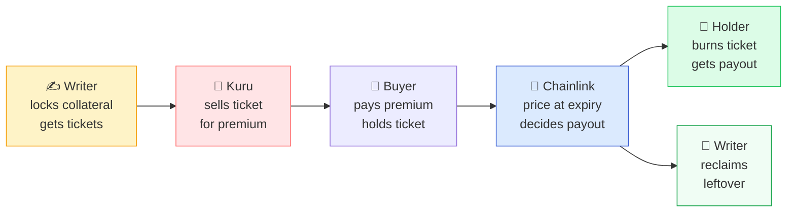

# 🌿 Optara — Documentation Hub

### *Secure, transparent, fully collateralized options on Monad*

   

**Not audited. Not on mainnet yet.** Built and tested — 286 tests pass. Start with the guide that fits you.

---

### 💚 The One Promise

> **Trading changes *who owns* a ticket. It never changes *how much the vault owes*.**
> No wash trade, no fake liquidity, no crashed order book can drain collateral.

---

## 🚀 Pick your guide

### 👥 For Users

## 🌿 User Guide

**No code. No jargon.**

Learn what an option is, how to use Optara step-by-step, and **how to profit** as a writer or buyer — with real dollar examples.

<a href="./USER_GUIDE.md" style="background: #22c55e; color: white; padding: 10px 18px; border-radius: 8px; text-decoration: none; font-weight: bold; display: inline-block;">📖 Open User Guide →</a>

Calls vs Puts • Writer vs Buyer profit • 5-step flow Fees in plain English • FAQ

<!-- Developer guide hidden until keeper/indexer/kuru integration ready

### 🧑‍💻 For Developers
## ⚙️ Developer Guide
**Full technical reference.**
Architecture, exact math & vectors, settlement proofs, contract interfaces, roles, deployment runbook, and test matrix.

<a href="./DEVELOPER_GUIDE.md" style="background: #836EF9; color: white; padding: 10px 18px; border-radius: 8px; text-decoration: none; font-weight: bold; display: inline-block;">📖 Open Developer Guide →</a>

Factories • Vaults • ChainlinkAnchor • Guards Invariants • Fuzz • Slither

-->

---

## 🌟 What is Optara in one minute?

**Optara lets anyone create and trade options that are 100% backed by real collateral.**

| Job | Who does it | Can trading break it? |
|:---|:---|:---|
| 🛒 Who owns the ticket | **Kuru** (order book) | — |
| 🏦 How much is owed | **Optara vault** | **No** ✅ |
| 🔮 What price counts | **Chainlink at expiry** | **No** ✅ |

> Because of this split, wash trades, thin liquidity, or a down market can change *who holds* a ticket — but **never** what the vault owes.

**At a glance:**

| Question | Answer |
|:---|:---|
| 🔗 Chain | Monad (uses `WMON`, not native MON) |
| 🎫 Style | European — redeem *only after* expiry |
| 🔒 Backing | 100% — Calls = underlying, Puts = quote |
| 🛒 Trading | Kuru (price discovery only) |
| 🔮 Settlement | Chainlink feed *pinned to expiry* (proven on-chain) |
| ✅ Audited? | Not yet — see launch checklist |

---

## 🧭 What’s inside

| Section | What you get |
|:---|:---|
| **Start** | 🔌 Wallet in 2 min (wrap `MON→WMON`, faucet) + 🧮 Profit calculator (break-even, PnL table) |
| **Core** | 💰 Writer vs Buyer profit with stock-like examples, 5-step flow |
| **Safety** | ⚠️ 3 must-know risks (illiquidity, delayed settlement, premium ≠ fair) |
| **Reference** | 📚 Full specs in `simple-workflow/` — math, contracts, oracle, guard, tests |

<!-- Developer guide contents hidden
| Section | Users | Developers |
|:---|:---|:---|
| **Start** | 🔌 Wallet + calculator | 📍 Deployments + ABIs |
| **Core** | 💰 Writer vs Buyer | 🏗️ Architecture, 📦 Contracts, 🧮 Math |
| **Safety** | ⚠️ 3 risks | 🚨 Errors/Events, 🔐 Threats |
| **Build** | — | 🍳 Recipes, ⛽ Gas, 🚀 Deploy |
| **Ops** | — | 🗺️ Roadmap, 📝 Changelog |
-->

---

## 📚 Where to go next

| I want to… | Open… |
|:---|:---|
| Understand options and make profit | **[USER_GUIDE.md](./USER_GUIDE.md)** — calls/puts, wallet setup, calculator, 5-step flow, fees, FAQ |
| See the lean build spec | [`simple-workflow/README.md`](./simple-workflow/README.md) — 6 files that define V1 |
| See the full 19-doc spec | [`workflow/README.md`](./workflow/README.md) — reference (`simple-workflow/` wins on conflict) |
| See contracts + test results | [`contracts/README.md`](./contracts/README.md) — layout, 286 tests, sizes, status |

<!-- Developer guide links hidden
| Integrate / audit / deploy | **[DEVELOPER_GUIDE.md](./DEVELOPER_GUIDE.md)** — math, proofs, addresses, recipes, gas, catalog |
| Check what changed | [`DEVELOPER_GUIDE.md#--changelog`](./DEVELOPER_GUIDE.md#-changelog) |
-->

---

### 💚 Built with care. Tested heavily. Use with eyes open.

*If docs and code disagree, that’s a bug — fix one of them.*

