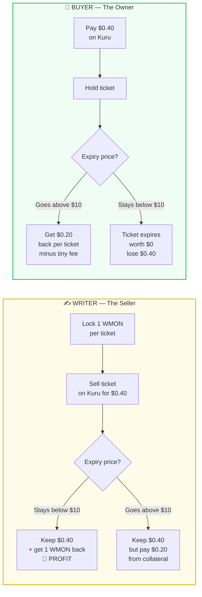
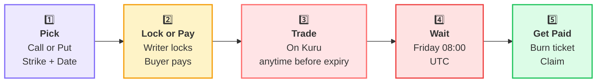

<div align="center">

# 🌿 Optara — User Guide

### *Options, made simple. No jargon. Just how to use it and how to profit.*

  

**You don’t need to be a trader to understand this.** If you can understand a bet with a friend, you can use Optara.

[💰 How to Profit](#-how-do-you-make-money) • [🎮 How to Use](#-how-to-use-optara--step-by-step) • [❓ FAQ](#-faq) • [⚠️ Risks](#️-3-things-you-must-know)

</div>

---

<div style="background: linear-gradient(90deg, #f0fdf4 0%, #eff6ff 100%); border: 2px solid #22c55e; border-radius: 12px; padding: 16px 20px;">

### 💚 The One Guarantee

> **Whatever is locked in the vault stays there until winners are paid.** Trading, hype, or a broken order book can’t touch it.

</div>

---

## 💡 What is an option? (30 seconds)

> 🎫 **An option is a ticket for a future price bet.**

You buy or sell the ticket *today*. On *Friday* you find out if it pays.

<br>

<div style="display: grid; grid-template-columns: 1fr 1fr; gap: 14px;">

<div style="background: #f0fdf4; border: 2px solid #22c55e; border-radius: 12px; padding: 18px; text-align: center;">

#### 📈 CALL

### *"Price will go UP"*

**You win if MON is ABOVE the line**

Example: Strike **$10**

*MON ends at $12 → you win $2* ✅

*MON ends at $9 → you get $0* ❌

<div style="background: white; border-radius: 8px; padding: 8px; margin-top: 10px; font-size: 0.9em;">

🟢 **Buy a Call** when you’re *bullish*

</div>

</div>

<div style="background: #fef2f2; border: 2px solid #ef4444; border-radius: 12px; padding: 18px; text-align: center;">

#### 📉 PUT

### *"Price will go DOWN"*

**You win if MON is BELOW the line**

Example: Strike **$10**

*MON ends at $8 → you win $2* ✅

*MON ends at $12 → you get $0* ❌

<div style="background: white; border-radius: 8px; padding: 8px; margin-top: 10px; font-size: 0.9em;">

🔴 **Buy a Put** when you’re *bearish*

</div>

</div>

</div>

<br>

<div style="background: #f8fafc; border: 1px solid #e2e8f0; border-radius: 10px; padding: 14px;">

| Word | Means | Example |
|:---|:---|:---|
| <span style="color:#836EF9">**Strike**</span> | The line you bet around | `$10` |
| ⏰ **Expiry** | When the bet ends | `Friday 08:00 UTC` |
| 💰 **Premium** | What you pay *today* for the ticket | `$0.40` per option on Kuru |
| 🔒 **Collateral** | What the seller locks to prove they can pay | `1 WMON` per ticket |

</div>

---

## 💰 How do you make money?

There are **two roles** — you can be either, or both. Same market, opposite bets.



<br>

<div style="display: grid; grid-template-columns: 1fr 1fr; gap: 14px;">

<div style="background: #fefce8; border: 2px solid #eab308; border-radius: 12px; padding: 18px;">

### ✍️ As a WRITER — *"The House"*

You **sell** tickets. You are betting the price **won’t** move your way.

**How you profit:**

1. Lock collateral (e.g., `5 WMON` for 5 calls)
2. Sell the 5 tickets on Kuru for `$2.00`
3. Wait until Friday

<div style="background: white; border-radius: 8px; padding: 12px; margin-top: 12px;">

**If MON stays ≤ $10** ✅

Ticket expires worthless. Buyer gets $0.

You get back **all 5 WMON** + **keep the $2.00**

→ **Pure profit = $2.00**

</div>

<div style="background: #fef2f2; border-radius: 8px; padding: 12px; margin-top: 10px;">

**If MON goes to $12** ⚠️

Buyer gets `0.20 WMON` per ticket = `1 WMON` total.

You get back **4 WMON** + **keep the $2.00**

→ You still kept premium, just paid part of collateral.

</div>

> **Writer = income if you think price won’t move much.**

</div>

<div style="background: #f0fdf4; border: 2px solid #22c55e; border-radius: 12px; padding: 18px;">

### 🛒 As a BUYER — *"The Bettor"*

You **buy** tickets. You are betting the price **will** move.

**How you profit:**

1. Pay premium on Kuru (e.g., `5 × $0.40 = $2.00`)
2. Hold until Friday (or sell early on Kuru to someone else!)
3. Redeem after settlement

<div style="background: white; border-radius: 8px; padding: 12px; margin-top: 12px;">

**If MON goes to $12** ✅

Each ticket pays `0.20 WMON` ≈ `$2.40`

5 tickets = **$12 in value** for **$2 spent**

→ Profit **≈ $10** (minus a tiny 0.25% fee)

You **6× your money**.

</div>

<div style="background: #fef2f2; border-radius: 8px; padding: 12px; margin-top: 10px;">

**If MON stays ≤ $10** ❌

Ticket worth $0. You lose the **$2.00** premium.

→ Max loss is *only* what you paid. Never more.

</div>

> **Buyer = big upside, limited downside.**

</div>

</div>

<br>

> [!TIP]
> **You can also profit without waiting!** Option tokens are normal ERC-20s. If the price moves in your favor *before* Friday, you can **sell the ticket on Kuru to someone else for more than you paid.** You don’t have to wait for expiry.

<br>

<div style="background: #eff6ff; border: 2px solid #375BD2; border-radius: 10px; padding: 16px;">

#### 🧠 Quick profit cheatsheet

| You do | You want | You profit when | Max win | Max loss |
|:---|:---|:---|:---|:---|
| **Sell a Call** ✍️ | Price stays *down* | `Price ≤ Strike` | Premium you collected | Collateral minus premium (capped at 1 WMON per ticket) |
| **Buy a Call** 🛒 | Price goes *up* | `Price > Strike` | Unlimited (price can soar) | Premium you paid |
| **Sell a Put** ✍️ | Price stays *up* | `Price ≥ Strike` | Premium you collected | Collateral minus premium (capped at `Strike × 1 WMON` in USDC) |
| **Buy a Put** 🛒 | Price goes *down* | `Price < Strike` | Up to `Strike` value per ticket | Premium you paid |

</div>

---

## 🎮 How to use Optara — step by step



<br>

<div style="background: #f8fafc; border: 1px solid #e2e8f0; border-radius: 10px; padding: 16px;">

#### Step 1️⃣ — Pick your bet

On the Optara app, choose:

- **Call** (bet UP) or **Put** (bet DOWN)
- **Strike** — e.g., `$10`
- **Expiry** — e.g., `Next Friday 08:00 UTC`

> The app only shows official series. Each one is like: *"WMON/USDC $10 Call — Friday"*

</div>

<div style="background: #fefce8; border: 1px solid #fde68a; border-radius: 10px; padding: 16px; margin-top: 12px;">

#### Step 2️⃣ — Lock (Writer) or Pay (Buyer)

**If you’re selling (Writer):**

- The app says: *“Lock 5 WMON + 0.005 fee”* → Approve → `Mint` → you get **5 tickets** in your wallet.
- Your tickets appear like any token — you can see them in your wallet.

**If you’re buying:**

- Go to the **Kuru market** linked on the series page (e.g., `OPT-WMON-USDC-C-1 / USDC`).
- Choose how many tickets, see the **all-in cost** (ticket price + Kuru fee), set your **max cost**, and buy.

</div>

<div style="background: #ffe4e6; border: 1px solid #fecdd3; border-radius: 10px; padding: 16px; margin-top: 12px;">

#### Step 3️⃣ — Trade anytime before Friday

- Hold, or **sell early on Kuru** if you want to lock profit/loss before expiry.
- Trading just moves *who owns* the ticket. The vault’s locked collateral doesn’t change.

</div>

<div style="background: #fee2e2; border: 1px solid #fecaca; border-radius: 10px; padding: 16px; margin-top: 12px;">

#### Step 4️⃣ — Friday 08:00 UTC: Expiry

- No more tickets can be created after this second.
- The Chainlink price **at this exact second** is frozen as the result — even if settlement happens later.

</div>

<div style="background: #eff6ff; border: 1px solid #bfdbfe; border-radius: 10px; padding: 16px; margin-top: 12px;">

#### Step 5️⃣ — After settlement: Get paid

A bot (or anyone) will call **Settle** — usually within an hour after expiry once Chainlink posts.

Then:

- **Holders:** Hit **Redeem** → your tickets are burned and you receive payout (`USDC` for Puts, `WMON` for Calls).
- **Writers:** Hit **Claim** → you get back whatever collateral wasn’t owed to holders.

> Don’t want to click? A keeper bot can do it for you — it always pays **you**, never itself. But you can always do it yourself.

</div>

---

## 💸 What does it cost?

<div align="center">

| Fee | Who pays | How much | When you see it |
|:---|:---|:---|:---|
| 🟡 **To create tickets** | Writer | **0.10%** of collateral | Added *on top* — you pay `5 + 0.005 WMON` |
| 🔵 **To cash out winners** | Holder | **0.25%** of winnings | Taken from payout *only if you win* |
| 🔴 **Kuru trading fee** | Buyer/Seller | Small % per trade | Shown separately on Kuru — **not** going to Optara |

</div>

<br>

<div style="background: #f0fdf4; border: 1px solid #bbf7d0; border-radius: 8px; padding: 12px 16px;">

✅ **No fee** to reclaim leftover collateral as a writer (you already paid). ✅ **No fee** if your ticket expires worthless — but you still need to burn it to clear it. ✅ Losing tickets cost you *only* the premium you paid — never more.

</div>

---

## 🔌 Get started — wallet in 2 minutes

<div style="background: #f8fafc; border: 1px solid #e2e8f0; border-radius: 10px; padding: 16px;">

**You need 3 things before your first trade:** a wallet on Monad, a little `MON` for gas, and `WMON` + `USDC` to trade.

</div>

<br>

<div style="display: grid; grid-template-columns: 1fr 1fr; gap: 12px;">

<div style="background: #ede9fe; border: 1px solid #ddd6fe; border-radius: 10px; padding: 16px;">

#### 1️⃣ Add Monad to your wallet

In MetaMask / Rabby / Phantom: *Add Network* → Enter Monad testnet details:

| Field | Testnet value |
|:---|:---|
| **Network name** | `Monad Testnet` |
| **RPC URL** | `https://testnet-rpc.monad.xyz` *(placeholder — see [DEVELOPER_GUIDE → Deployments](./DEVELOPER_GUIDE.md#-deployments)* |
| **Chain ID** | `*TBD*` |
| **Currency symbol** | `MON` |
| **Explorer** | `https://testnet-explorer.monad.xyz` |

> Not on testnet? Mainnet RPC will be posted at launch — same steps.

</div>

<div style="background: #fefce8; border: 1px solid #fde68a; border-radius: 10px; padding: 16px;">

#### 2️⃣ Get free test `MON`

- Go to the **Monad faucet** (link in app header once live)
- Paste your wallet address → receive `MON` for gas
- You’ll see it as native balance — no import needed

<div style="background: white; border-radius: 8px; padding: 10px; margin-top: 10px; font-size: 0.9em;">

💡 You need `MON` only for gas. Collateral is **WMON**, not `MON`.

</div>

</div>

</div>

<div style="display: grid; grid-template-columns: 1fr 1fr; gap: 12px; margin-top: 12px;">

<div style="background: #f0fdf4; border: 1px solid #bbf7d0; border-radius: 10px; padding: 16px;">

#### 3️⃣ Wrap `MON` → `WMON`

Optara uses `WMON` (wrapped, ERC-20) so behavior is predictable.

- In the Optara app: **Wrap** → enter amount (e.g., `5 MON`) → **Wrap**
- Or call directly: `WMON.deposit()` with `value = amount` *(see [DEVELOPER_GUIDE recipes](./DEVELOPER_GUIDE.md#-recipes--copy-paste))*
- `WMON` appears as an ERC-20 in your wallet. **Unwrap** anytime via `WMON.withdraw(amount)`.

> Keep ~`0.1 MON` unwrapped for gas. Wrap the rest you want to use as collateral.

</div>

<div style="background: #eff6ff; border: 1px solid #bfdbfe; border-radius: 10px; padding: 16px;">

#### 4️⃣ Get `USDC` (for Puts & premiums)

- **Calls** need `WMON` as collateral — if you only want Calls you can skip USDC.
- **Puts** need `USDC` as collateral, and **all premiums** are paid in `USDC` on Kuru.
- On testnet: use the **USDC faucet** in-app or `MockUSDC.mint(you, 100_000e6)`.
- Add USDC to wallet: Import token → paste `USDC` address from [Deployments](./DEVELOPER_GUIDE.md#-deployments) → decimals `6`.

<div style="background: white; border-radius: 8px; padding: 10px; margin-top: 10px; font-size: 0.9em;">

✅ Now: **Approve** → `WMON` for Calls, `USDC` for Puts — the app prompts you. One approval per token.

</div>

</div>

</div>

<br>

> [!TIP]
> **Stuck?** Check your wallet is on **Monad** (not Ethereum), you have **WMON** not native `MON` for collateral, and you **approved** the vault/Router. 90% of "transaction failed" is one of those three.

---

## 🧮 Profit calculator — will I win?

<div style="background: #f8fafc; border: 1px solid #e2e8f0; border-radius: 10px; padding: 16px;">

You don’t need math — just **two numbers**: your **premium** and the **price at expiry**. Here’s how to estimate before you click Buy.

</div>

<br>

#### How it works (no code)

<div style="display: grid; grid-template-columns: 1fr 1fr; gap: 12px;">

<div style="background: #f0fdf4; border: 2px solid #22c55e; border-radius: 10px; padding: 16px; text-align: center;">

**📈 CALL payout per ticket**

```
If S ≤ K:  payout = 0
If S > K:  payout = (S - K) / S  × 1 WMON
```

*Example: K=$10, S=$12 → (2/12)×1 = **0.166 WMON***

</div>

<div style="background: #fef2f2; border: 2px solid #ef4444; border-radius: 10px; padding: 16px; text-align: center;">

**📉 PUT payout per ticket**

```
If S ≥ K:  payout = 0
If S < K:  payout = (K - S)  in USDC per 1 WMON
```

*Example: K=$60k, S=$55k → **5,000 USDC***

</div>

</div>

<div style="background: #fffbeb; border: 1px solid #fde68a; border-radius: 8px; padding: 12px 16px; margin-top: 12px; text-align: center;">

**Profit = Payout − Premium** (minus 0.25% fee *only if* payout > 0) &nbsp;|&nbsp; **Break-even: CALL needs `payout = premium` → solve for `S`**

</div>

<br>

#### Try these scenarios (same as Vector 1 — `K=$10`, `1 WMON` per ticket)

<div align="center">

| You do | Premium you pay | Expiry price `S` | Payout per ticket | Fee (0.25%) | Net payout (5 tickets) | Profit (5 tickets) | Result |
|:---|---:|---:|---:|---:|---:|---:|:---:|
| **Buy Call** 🛒 | `$0.40` | `$9` | `$0` | `$0` | `$0` | **`−$2.00`** | 🔴 Lose premium |
| **Buy Call** 🛒 | `$0.40` | `$10` | `$0` | `$0` | `$0` | **`−$2.00`** | 🔴 At strike = lose |
| **Buy Call** 🛒 | `$0.40` | `$12` | `0.166 WMON ≈ $1.99` | `≈$0.005` | `≈$9.93` | **`+$7.93`** | 🟢 4.9× |
| **Buy Call** 🛒 | `$0.40` | `$15` | `0.333 WMON ≈ $5.00` | `≈$0.012` | `≈$24.94` | **`+$22.94`** | 🟢 12× |
| **Sell Call** ✍️ | *receive* `$0.40` | `$9` | `0` (you keep all) | — | you keep `5 WMON` | **`+$2.00`** | 🟢 Keep premium |
| **Sell Call** ✍️ | *receive* `$0.40` | `$12` | `0.166 WMON` to buyer | — | you keep `4.17 WMON` | **`+$2.00 −0.83 WMON`** | 🟡 Small net* |
| **Buy Put** 🛒 | `$1,200` | `$55k` (`K=$60k`) | `$5,000` | `$12.5` | `$24,937.5` | **`+$18,937`** | 🟢 4× |
| **Buy Put** 🛒 | `$1,200` | `$61k` | `$0` | `$0` | `$0` | **`−$6,000`** | 🔴 Lose |

<sub>*Writer profit in WMON terms: `5 − 0.833 = 4.17 WMON` + `$2` premium already in pocket. Writers profit in premium, lose collateral if in-the-money.</sub>

</div>

<br>

<div style="background: #eff6ff; border-left: 4px solid #375BD2; padding: 12px 16px; border-radius: 8px;">

#### 📱 In the app

The series page has a built-in slider: drag **expiry price** → see **payout / profit** live. It uses the exact formulas above, with fees included. **Use it before you buy** — don’t trust your mental math.

> **Worksheet:** `quantity × premium = total cost` — compare that to `quantity × payout at S` for the `S` you expect. If `payout > premium`, you profit.

</div>

<br>

<details>
<summary>🧮 <b>Break-even cheat (click to expand)</b></summary>

**CALL break-even:** You need `S` high enough that `floor(C*(S-K)/S)` covers premium + fee.

Roughly: `S ≈ K / (1 − premiumPerTicket)` (in WMON terms). Example: `K=$10`, `premium=$0.40` paid in USDC — convert premium to WMON at current price to solve, or just use the in-app slider.

**PUT break-even:** Need `K − S` in USDC to exceed premium. Example: `K=$60k`, premium `$1,200` → need `S < $58,800` to profit.

</details>

---

## ⚠️ 3 things you must know

<div style="display: grid; gap: 12px;">

<div style="background: #fef2f2; border-left: 5px solid #ef4444; padding: 14px 16px; border-radius: 8px;">

#### 1. 🔴 You might not be able to sell early

Kuru needs a buyer on the other side. If no one is trading that series, you’re stuck holding until Friday. **Plan for this.** Settlement + redemption still work even if Kuru is empty — you just can’t exit early.

</div>

<div style="background: #fffbeb; border-left: 5px solid #f59e0b; padding: 14px 16px; border-radius: 8px;">

#### 2. 🟡 Settlement isn’t instant

It waits for Chainlink to post *one update after expiry* (up to ~1 hour). Price is still fixed at expiry — the wait doesn’t change it. Just be patient.

</div>

<div style="background: #fef2f2; border-left: 5px solid #ef4444; padding: 14px 16px; border-radius: 8px;">

#### 3. 🔴 Premium isn’t “fair value”

The price you see on Kuru is what *someone is willing to pay* — not what the ticket is *worth*. It can be manipulated, thin, or stale. Optara shows a safety range, but **never trust the last traded price alone**.

</div>

</div>

<br>

> [!CAUTION]
> **Not audited yet.** Optara is built and tested (286 tests) but hasn’t had an independent audit. Don’t put in more than you can afford to lose. This is not financial advice.

---

## ❓ FAQ

<details>
<summary>💰 <b>Which makes more money — buying or selling?</b></summary>

**Selling (Writing):** Small, frequent wins. You collect premium often. One big price move against you eats into it.

**Buying:** Less frequent wins, but wins can be huge. You risk only the premium.

Many people do both at different times.

</details>

<details>
<summary>📈 <b>Can I lose more than I put in?</b></summary>

- **Buyer:** Never. Max loss = premium you paid (e.g., `$2`).
- **Writer:** Max loss = collateral you locked (e.g., `1 WMON` per call) minus premium. You can’t be liquidated beyond that — no leverage.

</details>

<details>
<summary>⏰ <b>Do I have to wait until Friday?</b></summary>

No! You can sell your ticket on Kuru **anytime before expiry** to someone else. After expiry, you must wait for settlement and then redeem/claim.

</details>

<details>
<summary>🔄 <b>Can I sell half my tickets?</b></summary>

Yes. Tickets are ERC-20s. Sell 1 of your 5 if you want. Redeem any nonzero amount — no minimum after minting.

</details>

<details>
<summary>🏦 <b>Where is my money during the bet?</b></summary>

Locked in the **vault contract** (`OptionSeriesVault`). Not with Kuru, not with a person. The vault can’t be upgraded, can’t be drained, and can’t be paused for payouts. Code is the safe.

</details>

<details>
<summary>🎯 <b>What if Chainlink goes down?</b></summary>

In V1, if Chainlink *never* posts after expiry, that series **can never settle** — funds are stuck. This is disclosed upfront. Mitigation: Optara launches only on major, actively updated Chainlink feeds and keeps expiries short (≤ 30 days). A recovery module may be added later.

</details>

<details>
<summary>🪙 <b>What’s WMON vs MON?</b></summary>

`WMON` is wrapped MON — an ERC-20 that behaves predictably. Native `MON` isn’t used because it doesn’t act like a standard token.

</details>

<details>
<summary>👀 <b>How do I know a token is real?</b></summary>

Check if the app shows it as **“Official”** (it checks `factory.isOptionToken()` on-chain). Don’t trust names/symbols — anyone can copy `OPT-WMON-USDC-C-1`.

</details>

---

## 🧭 Quick glossary

| Word | One-liner |
|:---|:---|
| 📈 **Call** | Win if price goes **up** |
| 📉 **Put** | Win if price goes **down** |
| 🎯 **Strike** | The line you bet around |
| ⏰ **Expiry** | Deadline — Friday 08:00 UTC |
| 💰 **Premium** | Price of the ticket today |
| 🔒 **Collateral** | Locked guarantee |
| 🪙 **Vault** | The safe holding collateral + your ticket |
| 🛒 **Kuru** | The market where tickets trade |
| 🔮 **Chainlink** | The oracle deciding the final price at expiry |

---

<div align="center">

### Ready to build or go deeper?

*For the technical spec, architecture, and contracts →* **[🧑‍💻 Developer Guide](./DEVELOPER_GUIDE.md)**

*For all specs →* **[📚 Documentation Hub](./DOCUMENTATION.md)**

</div>
